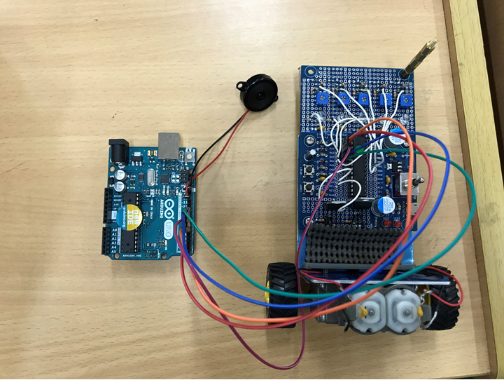
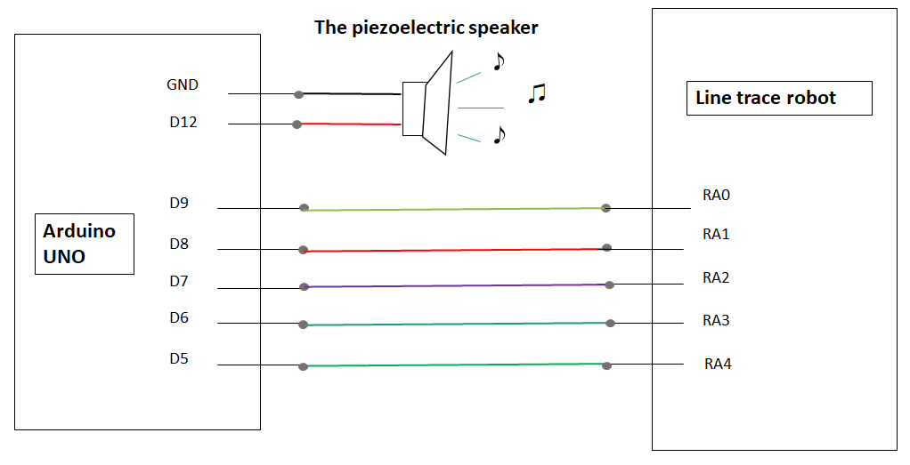

# gPBL_2019
#Hanoi University of Science and Technology - Shibaura Institute of Technology
 
# Product

#Musical performance robot. The robot to play music using the Line Trace Robo's phototransistor.

# Circuit Diagram

Project used:
 - A piezoelectric speaker
 - Arduino UNO
 - Line trace robot.

# Challenges Point
 - The robot couldn’t go straight.
 - The noises 
